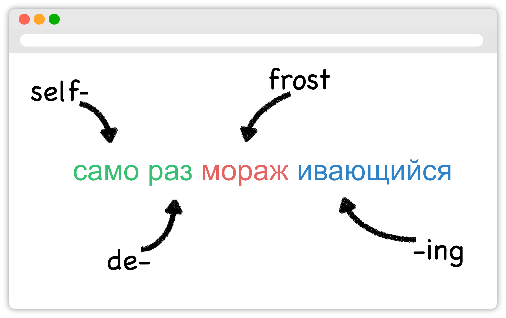

</br>

<!-- badges:
- build pass/fail (built into GitHub)
- coverage percentage (provided by codecov) -->

[](https://codecov.io/gh/rootski-io/rootski)

<!--
custom badges:
Each of these are created using a open-source, free, publically hosted service called sheilds.io
GitHub gist explaining how to make custom badges like these: https://github.com/8bitDesigner/slack-badge/blob/master/README.md
sheilds.io homepage where color choices are documented: https://shields.io/
 -->
[](https://join.slack.com/t/rootskiio/shared_invite/zt-13avx8j84-mocJVx5wFAGNf5wUuy07OA)
[](https://quickest-trail-808.notion.site/Rootski-Knowledge-Base-49bb8843b6424ada9f49c22151014cfc)
[](https://sharing.clickup.com/l/h/4-30114956-1/80ea8d248c817f3)
[](https://www.youtube.com/playlist?list=PLwF2z4Iu4rabmY7RbRNetjZprLfe8qWNz)

<!-- ALL-CONTRIBUTORS-BADGE:START - Do not remove or modify this section -->
[](#contributors-)
<!-- ALL-CONTRIBUTORS-BADGE:END -->

# 📣 Welcome to the rootski codebase!

This is the codebase for the application running at [rootski.io](https://www.rootski.io).

> 🗒 Note: you can find detailed information about the [architecture/tech stack](https://quickest-trail-808.notion.site/rootski-Architecture-9892c9f2159e4865a4438c163e235c41), onboarding/contributing, general full-stack development training resources and more on our [knowledge base](https://quickest-trail-808.notion.site/Rootski-Knowledge-Base-49bb8843b6424ada9f49c22151014cfc).

rootski is a full-stack application for studying the Russian language by learning roots.

rootski uses an A.I. algorithm called a "transformer" to break Russian words into roots. rootski enriches
the word breakdowns with data such as definitions, grammar information, related words, and examples
and then displays this information to users for them to study.

</br></br>

## How is the rootski project run? (Hint, click here to [get involved](https://quickest-trail-808.notion.site/Rootski-Knowledge-Base-49bb8843b6424ada9f49c22151014cfc) 😃)

rootski is developed by volunteers! Emojis represent types of contributions, ([emoji key](https://allcontributors.org/docs/en/emoji-key))

<!-- ALL-CONTRIBUTORS-LIST:START - Do not remove or modify this section -->
<!-- prettier-ignore-start -->
<!-- markdownlint-disable -->
<table>
  <tr>
    <td align="center"><a href="https://github.com/ir3456"><br /><sub><b>Isaac Robbins</b></sub></a><br /><a href="https://github.com/rootski-io/rootski/commits?author=ir3456" title="Code">💻</a> <a href="#infra-ir3456" title="Infrastructure (Hosting, Build-Tools, etc)">🚇</a></td>
    <td align="center"><a href="https://github.com/jabracadabrah"><br /><sub><b>Josh Abrahamsen</b></sub></a><br /><a href="#infra-jabracadabrah" title="Infrastructure (Hosting, Build-Tools, etc)">🚇</a></td>
    <td align="center"><a href="https://github.com/phitoduck"><br /><sub><b>Eric Riddoch</b></sub></a><br /><a href="#mentoring-phitoduck" title="Mentoring">🧑‍🏫</a> <a href="https://github.com/rootski-io/rootski/commits?author=phitoduck" title="Code">💻</a></td>
    <td align="center"><a href="https://github.com/rgard90"><br /><sub><b>Ryan Gardner</b></sub></a><br /><a href="#business-rgard90" title="Business development">💼</a></td>
  </tr>
</table>

<!-- markdownlint-restore -->
<!-- prettier-ignore-end -->

<!-- ALL-CONTRIBUTORS-LIST:END -->

Above all else, rootski is a platform for learning and mentoring anyone with an interest in

- frontend/backend development
- developing data science models
- data engineering
- analytics
- MLOps
- DevOps
- UI/UX design
- product design
- building a SaaS product that handles real customer transactions (note, we're aware of GDPR and data privacy regulations and do not expose the subset of customer data that is sensitive to contributors)
- running a business

The best way to learn to write production-ready software is to... write production-ready software 🤣. If one of these describes you, you may really enjoy contributing some pieces to rootski,

- you are inexperienced at writing software, modeling, doing analytics, etc., but you would love to learn how it is done--ideally with the guidance of some really experienced, friendly mentors
- you work in some area of tech for you day job and want to explore areas to keep growing, but you don't necessarily want to build an entire SaaS product yourself just to learn about a handful of sub-parts of that

Engineers learn a lot by seeing examples of how things are built. The difficulty there is that
you typically have to join a company to see the inside of a large SaaS product. rootski is "built in the open"
so that anyone interested in software or data science can see a fully working example of an SaaS/AI
product built with industry best practices.

If you're [willing to learn](https://www.linkedin.com/posts/eric-riddoch_im-willing-to-learn-candidates-for-ds-activity-6895803295609233408-dKmu), we'd love to have you on our team!

We have training materials that can take you from whatever experience level you may be at and get you onboarded and contributing.

To get started, read the [Contributing](#contributing) section below.

</br>

### Contributors who have onboarded and contributed features

- [Eric Riddoch](https://ericriddoch.info) - Been working on rootski for 3 years and counting!
- [Ryan Gardner](https://www.linkedin.com/in/gardner-ryan/) - Helping with all of the legal/business aspects and dabbling in development
- [Isaac Robbins](https://www.linkedin.com/in/isaacrobbins/) - Learning and building experience in MLOps and DevOps!
- [Josh Abrahamsen](https://www.linkedin.com/in/joshabrahamsen/) - Experienced in SDET/DevOps/Azure looking to gain experience in more languages and technologies.

### Friends

Completed a lot of the rootski onboarding and chat with us in our [Slack workspace](https://join.slack.com/t/rootskiio/shared_invite/zt-13avx8j84-mocJVx5wFAGNf5wUuy07OA) about miscellaneous code questions, careers, advice, etc.

- [Colin Varney](https://www.linkedin.com/in/colin-varney-b7283135/) - Full-stack python guy. Is working his first full-time software job!
- [Fazleem Baig](https://www.linkedin.com/in/fazleem-baig/) - MLOps guy. Quite experienced with Python and learning about AWS. Working for an AI startup in Canada.
- [Ayse (Aysha) Arslan](https://www.linkedin.com/in/ayse-seyyide-arslan-5b1594137/) - Learning about all things MLOps. Working her first MLE/MLOps job!
- [Sebastian Sanchez](https://www.linkedin.com/in/sebbsanchez/) - Learning about frontend development.
- [Yashwanth (Yash) Kumar](https://www.linkedin.com/in/yashpkumar/) - Finishing up the Georgia Tech online masters in CS.
- [Ben Doyle](https://www.linkedin.com/in/benjamin-doyle/) - Mixed work experience in NLP, full-stack development, and data analytics. Finishing undergrad at BYU in December 2022.


</br></br></br></br></br>

## Contributing

> ⚠️ Disclaimer, please read! Contributing is 100% "free labor" in the sense that Eric Riddoch owns the rootski project. Please *do* or please *don't* contribute based on what you think is best for your career and personal growth. The value of contributing to rootski is really in getting to work on part of a real product, having mentorship, and experimenting with tools you don't use at your day job. Whether or not you're experienced, that "mentorship" looks exactly the way it would at a paid job: we're a bunch of non-experts working together, some of us knowing more about certain technologies than others. For Eric, this project truly is about learning/mentoring and he'd rather move really slowly so that people can learn rather than focus on exploiting people adding new features. Eric pays $20+/mo (sometimes $50) on this and earns nothing. If that ever changes, he will be clear about that. If anyone were to be paid to work on this, the project simply wouldn't be possible. Eric is happy if the work we're doing here does nothing more than give people career opportunities and help remove confusion about how "real" software is built. Many of the contributors make real sacrifices offering their time and mentorship working on this project. Please don't criticize our motives. We truly do want you do do what's best for you.  This model for building a product was inspired by this [podcast interview with the creator of the Python discord channel](https://talkpython.fm/episodes/show/305/python-community-at-python-discord). Eric finds their intentions to be genuine. Please know that for over a year, Eric has "sunk" many evenings and weekends mentoring engineers and has seen no personal "return on investment" outside of relationships; he will gladly continue to do so, time permitting. Feel free to reach out to any of the "Contributors" or "Friends" to ask them about their experience.

If you would like to contribute, please do the following things:

1. [ ] Join the [Slack workspace](https://join.slack.com/t/rootskiio/shared_invite/zt-13avx8j84-mocJVx5wFAGNf5wUuy07OA) and introduce yourself in `#general`. It's nice to know
   - Where are you from?
   - Where are you now?
   - How long have you been coding/writing software/doing data science/doing what you do?
   - Did you go to school or do any other type of training?
   - Which parts of rootski are exciting to you?
   - What are some of your career and life goals?
   - How fast/slow would you like to onboard and contribute (roughly, it changes for all of us)
   - no need to be formal, we're all friends here :D
2. [ ] Create a ClickUp account and ask to have onboarding tickets made for you in `#onboarding-and-training` (in Slack).

   > These tickets have you install the tools described below, get rootksi running, get access to GitHub and AWS, get familiar
   with the architecture and [the ticket board](https://sharing.clickup.com/l/h/4-30114956-1/80ea8d248c817f3), and other fairly straightforward things. Reading through the [knowledge base](https://quickest-trail-808.notion.site/Rootski-Knowledge-Base-49bb8843b6424ada9f49c22151014cfc),
   browsing the ticket board, reaching out to other in Slack, and watching the YouTube videos will get you there if you
   don't want to wait for someone to create tickets for you. The tickets just help us know what you've done so we can help you.
   There are often more ideas in Eric's head than there are tickets on the board, so feel free to reach out to Eric in Slack as well.
   >
   > Please forgive Eric if he is slow to respond. He is usually overwhelmed with answering messages, reviewing PRs, onboarding people,
   writing tickets, writing social media posts promoting the contributors and their work, collaborating on the tickets themselves,
   pair programming, mentoring folks here and creating learning programs for them, and miscellaneous tasks that are hard to quantify. To say the least, there is certainly opportunity here to be a leader and own parts of the process that Eric would gladly hand off 🤣.
3. [ ] In the "What I Do" section of your Slack profile, enter your email address so we can see it when we hover over your name.
   It's best if this is the email you use for GitHub and ClickUp. That makes it easier to add you.

</hr>

This codebase uses a mix of languages and tools. Depending on what area you'd like to
contribute to you only need to have a subset of the technologies installed.

To contribute to either the frontend, backend, or AWS infrastructure, you will need the following installed:

### Install all the tools!

> 🗒 Note: [`onboard.sh`](./onboard.sh) is an experimental script that will attempt to download many of things things.
> It should work on both Mac OS and the WSL. Note that the script is *highly* opinionated, and you
> may prefer to only reference it or just run bits and pieces.

> 🗒 Note: There are *many* technologies listed here, if you need more direction getting these set up or learning what
> these are, there is a [page on the knowledge base](https://quickest-trail-808.notion.site/Developer-Tools-Collaboration-d195c1d6c0f14643b370a9ceff323e75) to help you get up to speed.

**Everyone**

- [ ] `git`
- [ ] `git-lfs` to download CSVs and other "large" files needed for development
- [ ] `docker`
  - [ ] Also install Docker Desktop if on Mac OS or Windows
  - [ ] If on Windows, set up the WSL and enable the WSL backend for Docker Desktop (does not work if you have less than Windows 10 Pro 😢)
- [ ] `cmake` so you can use the ['makefile'](./makefile)
- [ ] Python 3.8 or 3.9 (`python --version` must return 3.x.x, the `makefile` won't work if you have to use `python3`); `pyenv` is the recommended way to install python and easily switch between python versions
- [ ] VS Code, PyCharm, or both
  - [ ] See the knowledge base for [recommended VS Code extensions](https://www.notion.so/Developer-Tools-Collaboration-d195c1d6c0f14643b370a9ceff323e75#efab15431b5e48daba7259bedcdce38a)

**Front end**

- [ ] NodeJS (`npm`)

**Infrastructure in AWS**

> 🗒 Note: Certain backend tests require AWS access, but it is fine if those do not execute on your machine as you develop on the backend.

- [ ] AWS CLI (version 2)
  - [ ] Configure a `rootski` profile with `aws configure --profile rootski`. Ask Eric or an AWS admin for credentials for this command.

**Optional**

- [ ] [DBeaver](https://dbeaver.io/), a desktop program for exploring the rootski Postgres SQL database


#### (one time) Validate your setup by running rootski

Assuming you have each tool set up correctly, you should be able to run the following commands:

```bash
# clone this repository
git clone https://github.com/rootski-io/rootski.git
cd ./rootski/

# create a virtual environment called venv/
python -m venv ./venv/

# activate your virtual environment
source ./venv/bin/activate

# install pre-commit, git-lfs, DVC, xonsh, and other utilities needed to run makefile targets
make install

# run the frontend and backend locally in docker
make run
```

^^^ If this script works, you should be set to develop on rootski! Use one of the following sets of
commands to develop on the backend or frontend.

> 🗒 Note: explore the [`makefile`](./makefile) or run `source ./venv/bin/activate; make help` to
> explore several utility commands that make running and working with the rootski project easier.

#### (each time) Develop on the frontend

Run these commands each time you want to develop on the frontend.

```bash
cd path/to/rootski/

# start the backend API and database and add seed data to the database
source ./venv/bin/activate  # required for pre-commit hooks to work!
make install
make build-images
make start-backend
make seed-dev-db

# start the frontend for development
cd ./rootski_frontend/
npm install  # install node dependencies
npm run start  # start the frontend development server
```

#### (each time) Develop on the backend

Run these commands each time you want to develop on the backend.

> 🗒 Note: explore the [`rootski_api/Makefile`](./rootski_api/Makefile) or run `cd rootski_api; make help` to
> explore various ways to run run the backend API with and without docker.

```bash
cd path/to/rootski/

# activate virtual environment and install global python requirements
source ./venv/bin/activate  # required for pre-commit hooks to work!
make install

cd ./rootski_api/
make install  # install backend specific python requirements
make run-local-db
cd ..
make seed-dev-db
cd ./rootski_api/
make run
```


<!--
## The Technical Stuff

### How to deploy an entire rootski environment from scratch

Going through this, you'll notice that there are several one-time, manual steps. This is common even for teams
with a heavily automated infrastructure-as-code workflow, particularly when it comes to the creation of users
and storing of credentials.

Once these steps are complete, all subsequent interactions with our rootski infrastructure can be done
using our infrastructure as code and other automation tools.

#### 1. Create an AWS account and user

1. Create an IAM user with programmatic access
2. Install the AWS CLI
3. Run `aws configure --profile rootski` and copy the credentials from step (1). Set the region to `us-west-2`.

> 🗒 Note: this IAM user will need sufficient permissions to create and access the infrastructure that will
be discussed below. This includes creating several types of infrastructure using CloudFormation.

#### 2. Create an SSH key pair

1. In the AWS console, go to EC2 and create an SSH key pair named `rootski`.
2. Download the key pair.
3. Save the key pair somewhere you won't forget. If the pair isn't already named, I like to rename them and store them at `~/.ssh/rootski/rootski.id_rsa` (private key) and `~/.ssh/rootski/rootski.id_rsa.pub` (public key).
4. Create a new GitHub account for a "Machine User". Copy/paste the contents of `rootski.id_rsa.pub` into any boxes you have to to make this work :D
this "machine user" is now authorized to clone the rootski repository!

#### 3. Create several parameters in AWS SSM Parameter Store

| Parameter      | Description |
| ----------- | ----------- |
| `/rootski/ssh/private_key`      | The contents of the private key needed to clone the `rootski` repository.       |
| `/rootski/prod/database_config`   | A stringified JSON object with database connection information (see below) |

```json
{
    "postgres_user": "rootski-db-user",
    "postgres_password": "rootski-db-pass",
    "postgres_host": "database.rootski.io",
    "postgres_port": "5432",
    "postgres_db": "rootski-db-database-name"
}
```

#### 4. Purchase a domain name that happens to be `rootski.io`

You know, the domain name `rootski.io` is hard coded in a few places throughout the rootski infrastructure.
It felt wasteful to parameterize this everywhere since... it's unlikely that we will ever change our domain name.

If we ever have a need for this, we can revisit it :D

#### 5. Create an ACM TLS certificate verified with the DNS challenge for `*.rootski.io`

You'll need to do this in the AWS console. This certificate will allow us to access `rootski.io`
and all of its subdomains over HTTPS. You'll need the ARN of this certificate for a later step.

#### 4. Create the rootski infrastructure

Before running these commands, copy/paste the ARN of the `*.rootski.io` ACM certificate
into the appropriate place in `infrastructure/iac/cloudformation/front-end/static-website.yml`.

```bash
# create the S3 bucket and Route53 hosted zone for hosting the React application as a static site
...

# create the AWS Cognito user pool
...

# create the AWS Lightsail instance with the backend database (simultaneously deploys the database)
...

# deploy the API Gateway and Lambda function
...
```

#### 5. Deploy the frontend site

```bash
make deploy-frontend
```

DONE! -->
