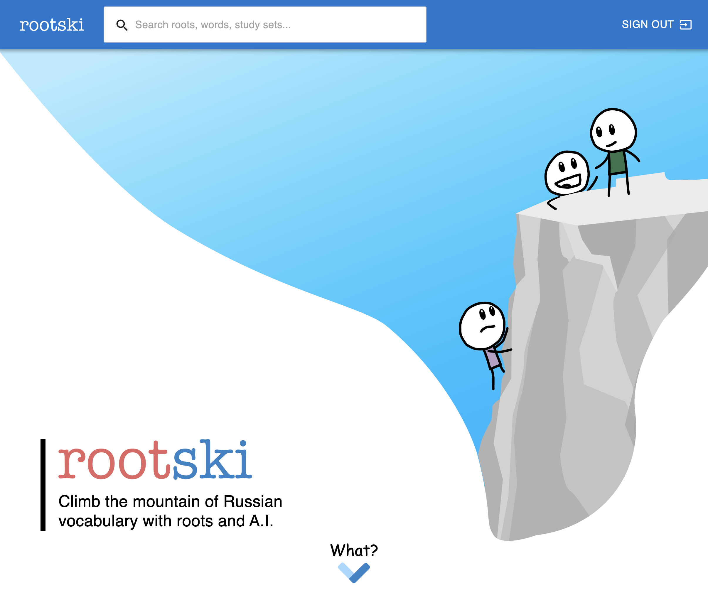
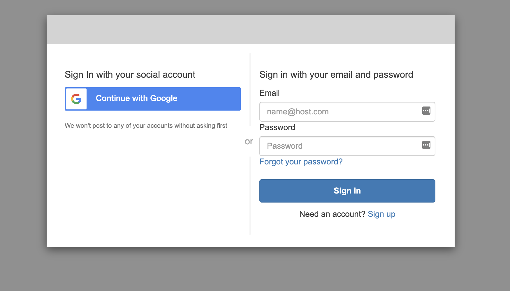

.. _frontend-architecture-page:

.. |br| raw:: html

     

===============
The Frontend
===============

    Screenshot of `www.rootski.io <https://www.rootski.io>`_ taken March 12, 2022

|br|

Getting Started
-----------------

All the code for the frontend is in the `rootski/rootski_frontend/ <https://github.com/rootski-io/rootski/tree/trunk/rootski_frontend>`_ folder.

.. |node-js| raw:: html

    <i class="fab fa-node fa-2x" style="color: green"></i>

.. |gear| raw:: html

    <i class="fa-solid fa-gear fa-2x" style="color: gray"></i>

.. |docker| raw:: html

    <i class="fa-brands fa-docker fa-2x" style="color: royalblue"></i>

.. |python| raw:: html

    <i class="fa-brands fa-python fa-2x" style="color: #4B8BBE"></i>

.. note::

    You'll need to have certain dependencies installed on your machine to run the frontend.

    .. list-table::
        :widths: 10 90
        :align: left
        :class: borderless shadowless

        * - |node-js|
          - NodeJS
        * - |gear|
          - ``cmake``
        * - |docker|
          - Docker Desktop (or just Docker for Linux)
        * - |python|
          - Python 3.8+

You can run these commands to run rootski for development.

.. code-block:: bash

    # clone the repo and install some makefile dependencies
    git clone <rootski repo URL>
    cd ./rootski/

    # create a python virtual environment to install makefile dependencies
    python3 -m venv ./venv/
    source ./venv/bin/activate/  # activate the virtual environment
    make install  # install make dependendcies into the virtual environment

    # (Optional) start a local backend server with a development dataset
    cd ./rootski_api/
    docker-compose up -d
    cd ..
    make seed-dev-db

    # install dependencies
    cd ./rootski_frontend/
    npm install

    # start the local development server
    npm run start

|br|

The Frontend Tech Stack
-------------------------

Here are the main tools we are using to create the frontend:

.. |react| raw:: html

    <i class="fa-brands fa-react fa-2x" style="color: #61DAFB"></i>

.. |typescript| raw:: html

    <i class="fa-brands fa-js-square fa-2x" style="color: #007ACC"></i>

.. |cube| raw:: html

    <i class="fa-solid fa-cube fa-2x" style="color: purple"></i>

.. |aws| raw:: html

    <i class="fa-brands fa-aws fa-2x" style="color: #FF9900"></i>

.. list-table::
    :widths: 10 20 70
    :align: left
    :class: borderless shadowless

    * - |react|
      - React
      - JavaScript framework for writing re-usable "web-components"
    * - |typescript|
      - TypeScript
      - Language near identical to JavaScript; adds the ability to define types
    * - |cube|
      - Material UI
      - A library of pre-made web components
    * - |cube|
      - Redux
      - A "state management" library; we use it carefully!
    * - |aws|
      - AWS Cognito
      - A user authentication service that lets users create accounts and log in

.. warning::

    The frontend currently has no testing framework!
    This is something we want to add.

|br|

React with TypeScript
^^^^^^^^^^^^^^^^^^^^^^^^^^

The rootski front end was created by running

.. code-block:: bash

    npx create-react-app --template typescript

People talk about "exporting" your React app out of the ``create-react-app``
framework so that you can have more control over how it is configured
(changing Linting, TypeScript rules, the Webpack settings,
and several other things).

For now, we have found the opinionated set of defaults that come with
``create-react-app`` to be helpful. Eventually, we *could* export
our React app if the majority of frontend contributors feel strongly about
it.

|br|

Learning React
~~~~~~~~~~~~~~~~~

This is a fabulous course on React that is very accessible to beginners.

.. note::

    Before learning React, you should be comfortable with:

    - JavaScript (specifically using NodeJS with ``npm``)
    - Basic CSS
    - HTML

    Stephen Grider's `React course <https://www.udemy.com/course/react-redux/>`_ on Udemy

.. note::

    Udemy has sales at least once a week. This course should only
    be ~$10.

|br|

Learning TypeScript
~~~~~~~~~~~~~~~~~~~~

If you know JavaScript, then TypeScript is very easy to learn. This video
covers everything about TypeScript you would need for rootski.

.. note::

    We *highly* recommend following along with this video on your own
    computer to make sure you can write and execute TypeScript yourself.

Key things you should understand:

- how to install the TypeScript types for typical JavaScript libraries
- how to write complex types to document function parameters, classes, objects,
  union/intersection types, return types, etc.

.. raw:: html

    <iframe width="560" height="315"
      src="https://www.youtube.com/embed/NjN00cM18Z4"
      title="YouTube video player" frameborder="0"
      allow="accelerometer; autoplay; clipboard-write; encrypted-media; gyroscope; picture-in-picture"
      allowfullscreen>
    </iframe>

|br|

`Material UI <https://mui.com/components/app-bar/>`_
^^^^^^^^^^^^^^^^^^^^^^^^^^^^^^^^^^^^^^^^^^^^^^^^^^^^^^^

This is a JavaScript library of React web components
that are beautifully styled and easy to use.

Almost all of the UI surface in rootski is created
using Material UI components.

Material UI and Design Udemy Course
~~~~~~~~~~~~~~~~~~~~~~~~~~~~~~~~~~~~~~

    `Udemy course <https://www.udemy.com/course/implement-high-fidelity-designs-with-material-ui-and-reactjs/>`_ on Material UI, responsive design, and other useful topics

Just because you know React does *not* mean you know how to write
good-looking UIs that are responsive and pleasant to use.

A course like this one is a good next step for someone who has learned
React, but not a professional feeling UI.

If you stuck with this course to
the end and put your own flair on it, this would be a fabulous personal project,
despite coming from an online tutorial.

If you do not want to take this entire course, there are many good YouTube videos
on Material UI with TypeScript.

|br|

1-video crash course on Material UI
~~~~~~~~~~~~~~~~~~~~~~~~~~~~~~~~~~~~~~

.. raw:: html

    <iframe width="560" height="315" src="https://www.youtube.com/embed/Xoz31I1FuiY" title="YouTube video player" frameborder="0" allow="accelerometer; autoplay; clipboard-write; encrypted-media; gyroscope; picture-in-picture" allowfullscreen></iframe>

|br|

Mini YouTube course
~~~~~~~~~~~~~~~~~~~~~

This YouTube playlist has small videos dedicated to
one MUI topic at a time--such as the MUI grid system.

.. raw:: html

    <iframe width="560" height="315" src="https://www.youtube.com/embed/videoseries?list=PL4cUxeGkcC9gjxLvV4VEkZ6H6H4yWuS58" title="YouTube video player" frameborder="0" allow="accelerometer; autoplay; clipboard-write; encrypted-media; gyroscope; picture-in-picture" allowfullscreen></iframe>

|br|

Redux
^^^^^^^

Redux is a "state management" library for React apps.

You can think of Redux as a library that helps you maintain a single, massive
global variable with values for your entire React project. This could be
things like:

- the user who is logged in
- which page the user is looking at
- settings the user set in their profile
- ... any other values that are global to the entire app

Global variables are generally bad things, so rootski's philosophy on
redux is: **we should minimize the number of components that directly
depend on the redux state**. Prefer passing redux state values
as ``props`` to making components directly dependent on redux state.

To learn Redux, you can find free videos or watch the sections
on the Udemy course recommended in the :ref:`Learning React` section.

|br|

AWS Cognito
^^^^^^^^^^^^^

AWS Cognito is a service in AWS that lets us create users and
let them log in with Google. Thanks to this service, we don't have
to worry about writing code for:

- registering new users
- helping users reset their password if they forget it
- storing users' passwords (we never have access to their passwords, which is fantastic!)

|br|

The Cognito "Hosted UI"
~~~~~~~~~~~~~~~~~~~~~~~~

Cognito gives us a "Hosted UI" that we can route users to
when the click "Sign up / Sign in". It looks like this:

    AWS Cognito Hosted UI

|br|

JWT tokens
~~~~~~~~~~~~

Once users finish signing in with this UI, they are redirected backed
to `www.rootski.io <https://www.rootski.io>`_, but this time, they
have a "JSON Web Token" or "JWT Token" stored in their browser.

In our case, this JWT token is a JSON object with information about
the user like their email, and big long hash that we use as proof
that they logged in.

Whenever the frontend makes requests to the backend API, it inclues this
token in the headers which the backend API uses to decide if the incoming
request truly is authorized to request whichever data is being asked for.

.. code-block:: json
    :caption: A sample JWT token issued by AWS Cognito

    {
      "jwtToken": "eyJraWQiOiJ2QlU5akMxOFZZbWhCMDlVT0hWT0NoczlBMTV0XC84KzJUdkFKa1I2K2dqaz0iLCJhbGciOiJSUzI1NiJ9.eyJhdF9oYXNoIjoieGFIeUxIZkZ6RDlsR1hZQVAwcjV6ZyIsInN1YiI6ImQwYzM5NzJjLTBiMGYtNDE3Ny04Y2ZiLTYzNmExNzMzMTUwNSIsImNvZ25pdG86Z3JvdXBzIjpbInVzLXdlc3QtMl9OTUFURmxjVkpfR29vZ2xlIl0sImVtYWlsX3ZlcmlmaWVkIjpmYWxzZSwiaXNzIjoiaHR0cHM6XC9cL2NvZ25pdG8taWRwLnVzLXdlc3QtMi5hbWF6b25hd3MuY29tXC91cy13ZXN0LTJfTk1BVEZsY1ZKIiwiY29nbml0bzp1c2VybmFtZSI6Ikdvb2dsZV8xMTQxNjM0MDIyMTA5NjM3NzQxMzgiLCJvcmlnaW5fanRpIjoiNTlkNDE1YzAtNTQ0Ni00YzAyLTlkOTQtODU3Njk2MmIzZDQxIiwiYXVkIjoiMzV1ZmUxbmsydGFzdWcyZ21ibDVsOW1yYTMiLCJpZGVudGl0aWVzIjpbeyJ1c2VySWQiOiIxMTQxNjM0MDIyMTA5NjM3NzQxMzgiLCJwcm92aWRlck5hbWUiOiJHb29nbGUiLCJwcm92aWRlclR5cGUiOiJHb29nbGUiLCJpc3N1ZXIiOm51bGwsInByaW1hcnkiOiJ0cnVlIiwiZGF0ZUNyZWF0ZWQiOiIxNjI3MTgwNzUyMDkxIn1dLCJ0b2tlbl91c2UiOiJpZCIsImF1dGhfdGltZSI6MTYyNzI0Nzg5MywiZXhwIjoxNjI3MjUxNDk5LCJpYXQiOjE2MjcyNDc4OTksImp0aSI6ImVlN2NkNGNlLTNiMTktNGNhNi05MzM3LTMzNTMzYmEyZmQ3YyIsImVtYWlsIjoiZXJpYy5yaWRkb2NoQGdtYWlsLmNvbSJ9.nJz4ShOABJawb0Iys9jakm0Lqbi0MAXDZWIsaeOi3fnw0PI5ScFzGs7RR3vruehJT02KAFYlTLtbT5jrEPdz67eB3xaTS190l_RAZ0zmO2zTDpu-RVaIa0I4D5F1KesfbHwkZ7X1985UzVW5ZRr9yz8hcPL06sTuvMneWNH_2GdR-xn7XFb8qLkPwKKtF5gH-oQvV0wIW4DdbJ06RMPiHDhv9KaeXRl2l74SZMq8plxpDTB2jii5_-7y-huXSE-oGt0qwgA0m_LzVkTjMa6vgqNoSOsqtnHXdO6b5Q4jCKxH1VD5VzjSrxQQYnFRGPIans7uPgMX1pIsDR8-12m45Q",
      "payload": {
        "at_hash": "xaHyLHfFzD9lGXYAP0r5zg",
        "sub": "d0c3972c-0b0f-4177-8cfb-636a17331505",
        "cognito:groups": [
          "us-west-2_NMATFlcVJ_Google"
        ],
        "email_verified": false,
        "iss": "https://cognito-idp.us-west-2.amazonaws.com/us-west-2_NMATFlcVJ",
        "cognito:username": "Google_114163402210963774138",
        "origin_jti": "59d415c0-5446-4c02-9d94-8576962b3d41",
        "aud": "35ufe1nk2tasug2gmbl5l9mra3",
        "identities": [
          {
            "userId": "114163402210963774138",
            "providerName": "Google",
            "providerType": "Google",
            "issuer": null,
            "primary": "true",
            "dateCreated": "1627180752091"
          }
        ],
        "token_use": "id",
        "auth_time": 1627247893,
        "exp": 1627251499,
        "iat": 1627247899,
        "jti": "ee7cd4ce-3b19-4ca6-9337-33533ba2fd7c",
        "email": "joe.bob@gmail.com"
      }
    }

Here are some YouTube videos you can watch to better
understand how JWT tokens work.

.. note::

    JWT tokens are *the* industry stadard for "securing" REST APIs.
    Getting experience with using them is highly valuable for any
    engineering-adjacent career.

.. dropdown:: YouTube videos on JWT tokens

    .. raw:: html

        <iframe width="560" height="315" src="https://www.youtube.com/embed/QchYEZv3ysA" title="YouTube video player" frameborder="0" allow="accelerometer; autoplay; clipboard-write; encrypted-media; gyroscope; picture-in-picture" allowfullscreen></iframe>

    .. raw:: html

        <iframe width="560" height="315" src="https://www.youtube.com/embed/soGRyl9ztjI" title="YouTube video player" frameborder="0" allow="accelerometer; autoplay; clipboard-write; encrypted-media; gyroscope; picture-in-picture" allowfullscreen></iframe>

    .. raw:: html

        <iframe width="560" height="315" src="https://www.youtube.com/embed/UBUNrFtufWo" title="YouTube video player" frameborder="0" allow="accelerometer; autoplay; clipboard-write; encrypted-media; gyroscope; picture-in-picture" allowfullscreen></iframe>
